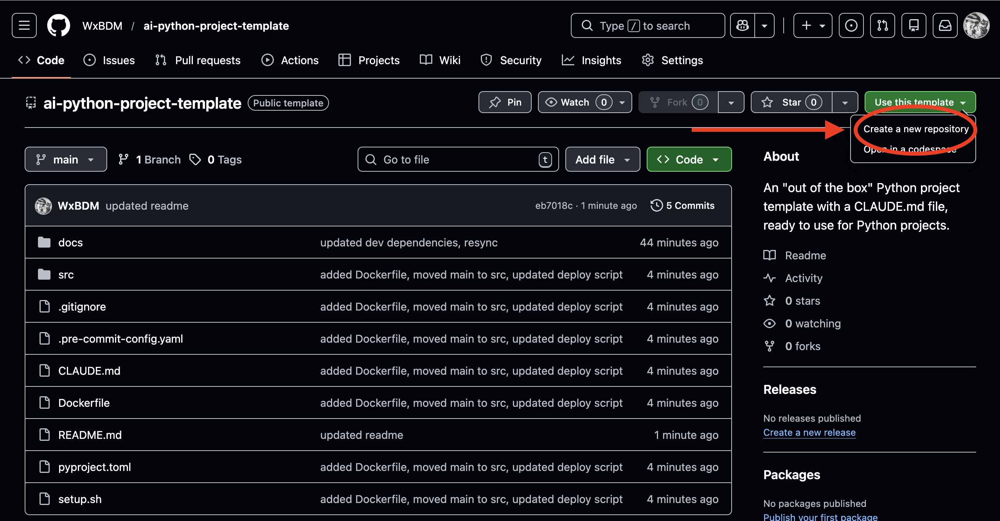

# Python Project Template

A modern Python project starter repository configured for the modern developer.

Bundled together with uv, pre-commit hooks, a Dockerfile, and a pre-configured CLAUDE.md that keeps it from writing garbage.

Use it as a template, launch a pre-written shell script, and you're off to the races.

**Built for developers who want all batteries included**

## Quick Start

### Step 1: Get the code

1. Click the green **"Use this template"** button at the top of this page
2. Select **"Create a new repository"**



3. Fill out the information that GitHub prompts you in that screen.

Once created, clone that repository to your local machine:

```bash
git clone <clone command>
cd <your-project-name>
```

### Step 2: Run the setup

Choose your operating system:

<details>
<summary><strong>Mac / Linux</strong></summary>

Run the setup script:

```bash
./setup.sh
```

The script will guide you through setup - follow the prompts on screen.

</details>

<details>
<summary><strong>Windows</strong></summary>

Run these commands in PowerShell:

```powershell
# Install the package manager: uv
powershell -ExecutionPolicy ByPass -c "irm https://astral.sh/uv/install.ps1 | iex"

# Install project dependencies
uv sync

# (Optional) Enable automatic code checking on commits
uv run pre-commit install
```

Then open `pyproject.toml` and change the project name, and create an empty `.env` file.

</details>

You'll see a repository that's ready to go, with the initial commit already done for
you. This is because there's some stubs and placeholders in the base repository that
is not needed for a fresh Python environment (such as the README file and the
associated images).

### Step 3: Start coding

Open `main.py` and start building your project.

To run your code:

```bash
uv run main.py
```

<details>
<summary><strong>What's included in this template?</strong></summary>

| Tool | What it does |
|------|--------------|
| [uv](https://docs.astral.sh/uv/) | Installs and manages Python packages |
| [Ruff](https://docs.astral.sh/ruff/) | Formats code and catches common mistakes |
| [pytest](https://docs.pytest.org/) | Runs your tests |
| [MkDocs](https://www.mkdocs.org/) | Creates documentation websites |
| [Pydantic](https://docs.pydantic.dev/) | Validates data in your application |
| [pre-commit](https://pre-commit.com/) | Runs checks before each commit |

</details>

<details>
<summary><strong>Project structure</strong></summary>

```
your-project/
├── main.py                 # Your application starts here
├── .env                    # Your secret settings (API keys, etc.)
├── pyproject.toml          # Project settings and dependencies
├── Dockerfile              # Container configuration
├── docs/                   # Documentation files
├── .pre-commit-config.yaml # Pre-commit hook settings
└── CLAUDE.md               # Development guidelines
```

</details>

<details>
<summary><strong>Common commands</strong></summary>

### Running your code

```bash
uv run main.py              # Run your application
uv run python               # Open Python interactive mode
uv run pytest               # Run your tests
```

### Adding packages

Need to use a library like `requests` or `pandas`? Add it with:

```bash
uv add requests
```

To remove a package:

```bash
uv remove requests
```

### Code quality tools

```bash
uv run ruff format .        # Auto-format your code
uv run ruff check .         # Check for issues
uv run ruff check . --fix   # Fix issues automatically
```

### Documentation

```bash
uv run mkdocs serve         # Preview docs at http://127.0.0.1:8000
```

</details>

<details>
<summary><strong>Pre-commit hooks explained</strong></summary>

If you enabled pre-commit hooks during setup, they automatically check your code every time you commit.

When you run `git commit`, you'll see:

```
ruff.................................................Passed
ruff-format..........................................Passed
```

If something fails, the tools usually fix it automatically. Just run:

```bash
git add .
git commit -m "your message"
```

To enable pre-commit hooks later:

```bash
uv run pre-commit install
```

</details>

<details>
<summary><strong>Development guidelines</strong></summary>

See [CLAUDE.md](CLAUDE.md) for detailed coding standards:

- Use `async`/`await` for file and network operations
- Handle errors with specific `try`/`except` blocks
- Add type hints to your functions
- Write docstrings using Google style

</details>
